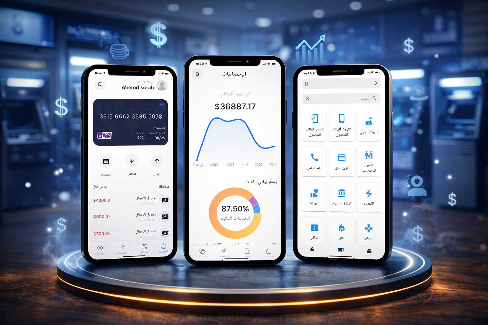
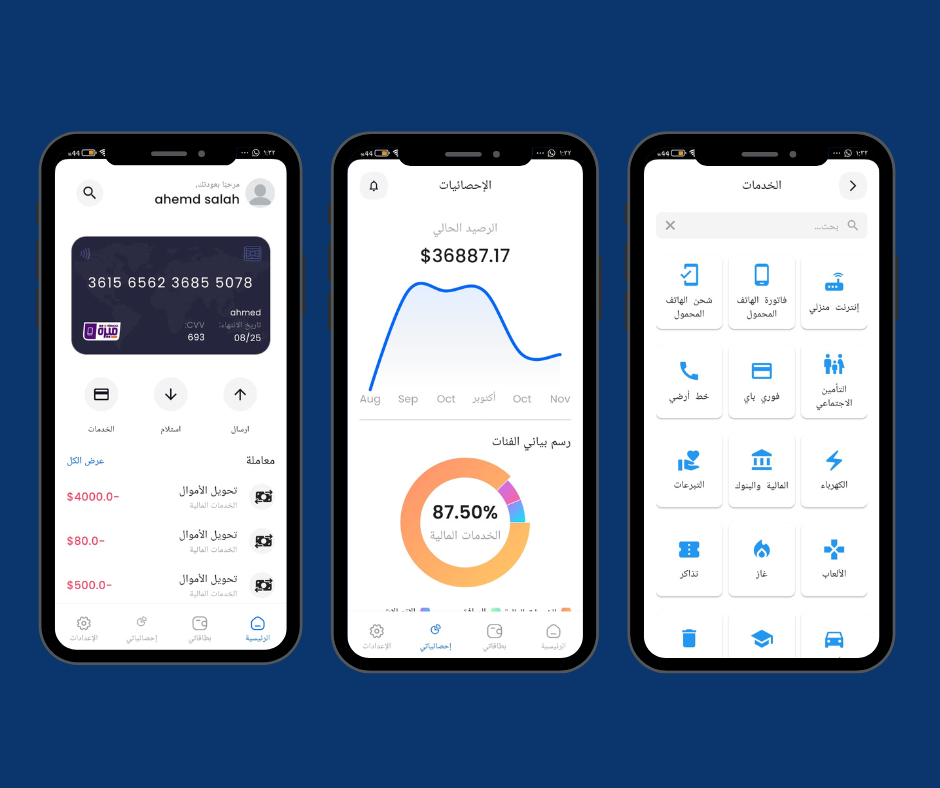

# Bank Online

<div align="center">
  

  <h3>A modern Flutter banking app for secure cards, payments, transfers, and financial insights.</h3>

  <p>
    <a href="https://flutter.dev"></a>
    <a href="https://dart.dev"></a>
    <a href="https://firebase.google.com"></a>
    
  </p>
</div>

## Preview

<p align="center">
  
</p>

<p align="center">
  
</p>

Screenshots are mirrored from the live portfolio project assets:
[Portfolio Project](https://ahmedsalah-dev.vercel.app/project/1)

## Overview

Bank Online is a cross-platform mobile banking experience built with Flutter. It brings together authentication, digital card management, transfers, service payments, QR flows, notifications, statistics, and user preferences in one polished app.

The project follows a feature-first structure with BLoC/Cubit state management, Firebase services, local settings persistence, generated localization, and reusable core widgets.

## Highlights

- Secure login, signup, password change, and local biometric authentication.
- Card management with card type detection, custom card UI, and NFC/card assets.
- Send money, receive money, QR scanning, and success confirmation flows.
- Service payment catalog including bills, telecom, electricity, donations, games, and more.
- Transaction history, search, filtering, notifications, and financial statistics.
- Light/dark theme support with persistent local settings.
- English and Arabic localization using generated `intl` files.
- Offline/connectivity handling with a dedicated no-connection screen.

## Tech Stack

| Layer | Tools |
| --- | --- |
| Framework | Flutter, Dart |
| State management | BLoC, Flutter BLoC, Cubits |
| Backend | Firebase Auth, Cloud Firestore, Firebase Storage |
| Local storage | Hive, Hive Flutter |
| Navigation | GoRouter |
| UI | Flutter SVG, Lottie, FL Chart, Syncfusion Charts, QR Flutter |
| Device features | Local Auth, Image Picker, Connectivity Plus, URL Launcher |
| Localization | Flutter Localizations, Intl |

## Project Structure

```text
lib/
  core/
    Routing/          App routes and navigation configuration
    helpers/          Constants, assets, and shared functions
    local/            Local settings and persistence helpers
    network/          Firebase service wrappers
    styles/           Theme, colors, and text styles
    widgets/          Reusable app widgets
  features/
    authentication/   Login and signup
    navigation_screen/Home, cards, and bottom navigation
    service/          Bill and service payments
    send_money_screen/
    receive_money/
    statistics/
    settings/
    profile/
    notification/
    search/
```

## Getting Started

### Prerequisites

- Flutter SDK `>=3.4.4`
- Dart SDK compatible with Flutter
- Firebase project configured for Android/iOS
- Android Studio or VS Code with Flutter extensions

### Installation

```bash
git clone <repository-url>
cd Banking_Mobile_App
flutter pub get
flutter run
```

### Firebase Setup

This app uses Firebase for authentication, Firestore, storage, and initialization. Make sure the platform Firebase files are configured before running a production build:

- `android/app/google-services.json`
- `ios/Runner/GoogleService-Info.plist`
- `lib/firebase_options.dart`

## Useful Commands

```bash
flutter pub get
flutter analyze
flutter test
flutter run
flutter build apk --release
```

## Portfolio Assets

The screenshots used in this README were sourced from the live portfolio assets supplied for Bank Online:

- Cloudinary showcase image
- Appwrite project preview image

They are stored locally under `docs/screenshots/` so the README remains stable even if external image URLs change.

## Author

Built by **Ahmed Salah** as a Flutter banking application focused on clean UI, Firebase integration, and practical mobile banking workflows.
